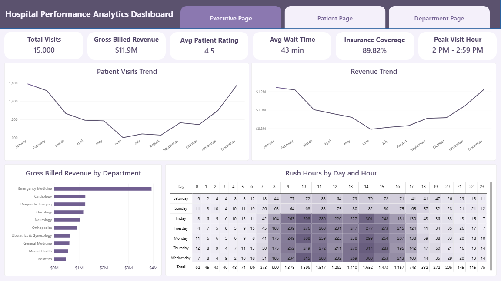
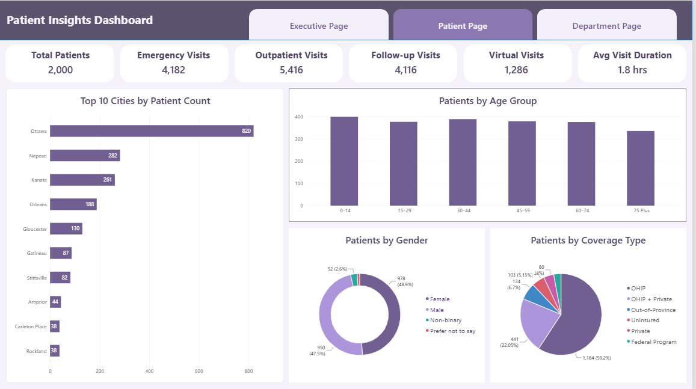
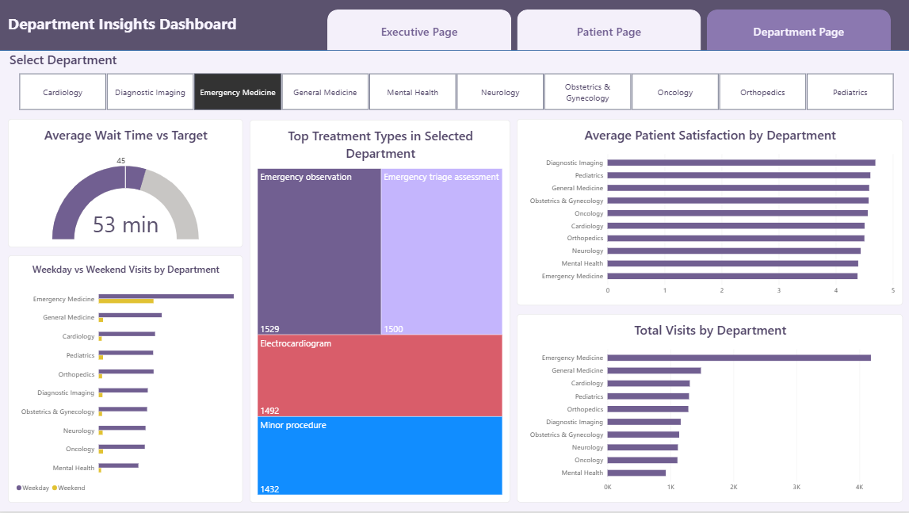
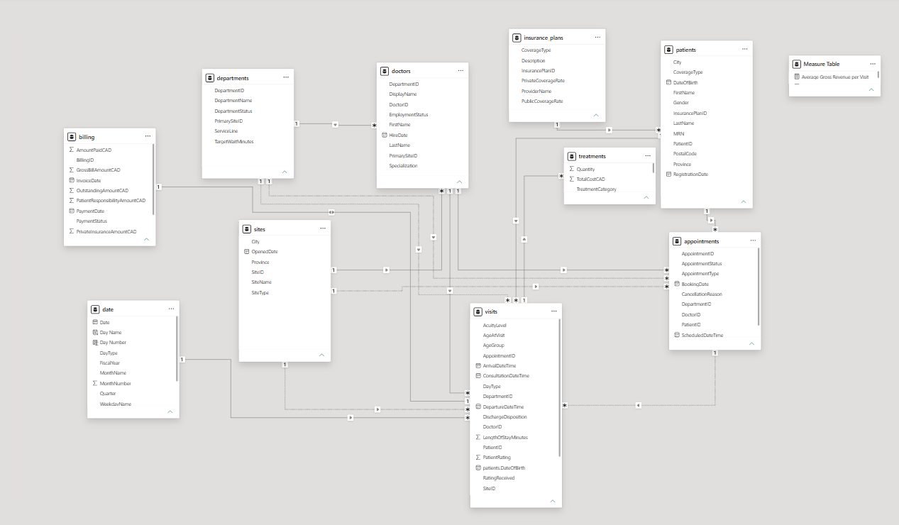

# Hospital Performance Analysis


## Project Overview

This project presents an interactive Power BI report designed to analyze hospital operations, patient activity, departmental performance, billing, and service quality.

The report transforms hospital data into clear operational and management insights. It enables users to monitor key performance indicators, compare departments, examine patient demographics, and identify patterns in visits, revenue, wait times, satisfaction, insurance coverage, and weekday versus weekend demand.

## Business Problem

Hospital decision-makers need a consolidated view of operational performance to answer questions such as:

- How many patient visits are being handled?
- Which departments receive the highest patient volume and generate the most revenue?
- What are the busiest hours for hospital services?
- How do patient wait times and satisfaction levels vary?
- How does demand differ between weekdays and weekends?
- Which treatments are most frequently provided by each department?
- What are the demographic and geographic characteristics of the patient population?
- How much of the gross billed amount is covered by public or private insurance?

The goal of this report is to make these questions easier to answer through a structured data model, reusable DAX measures, and interactive visual analysis.

## Project Objectives

- Build a complete Power BI report from a multi-table hospital dataset.
- Clean and transform the source data using Power Query.
- Design a relational data model for accurate filtering and analysis.
- Create reusable DAX measures for clinical, operational, and financial KPIs.
- Compare hospital departments by visits, revenue, satisfaction, and wait time.
- Analyze patient demographics, location, visit frequency, and insurance coverage.
- Support management decisions related to staffing, scheduling, service quality, and resource allocation.

## Dashboard Pages

### 1. Executive Summary

The Executive Summary provides a high-level view of hospital performance.

Key metrics and visuals include:

- Total Visits
- Rush Hours
- Average Patient Rating
- Average Wait Time
- Insurance Coverage Percentage
- Weekday vs Weekend Visits
- Patient Visit Trend
- Revenue Trend
- Gross Billed Revenue by Department
- Department-level visit comparison



### 2. Patient Analysis

The Patient Analysis page examines the characteristics and visit behaviour of the hospital's patient population.

Key metrics and visuals include:

- Total Patients
- Average Patient Age
- Average Visits per Patient
- Most Common Visit Type
- Top Cities by Patient Count
- Patients by Age Group
- Patients by Gender
- Patients by Coverage Type



### 3. Department Details

The Department Details page supports a deeper comparison of operational performance across hospital departments.

Key metrics and visuals include:

- Average Wait Time
- Average Patient Satisfaction by Department
- Total Visits by Department
- Gross Billed Revenue by Department
- Top Treatment Types by Department
- Weekday vs Weekend Visits by Department
- Department filtering for focused analysis



## Data Model

The report uses a relational model that connects hospital activity with patient, provider, department, treatment, billing, appointment, insurance, location, and date information.

Main tables include:

- Visits
- Patient
- Doctor
- Department
- Treatment
- Appointment
- Billing
- Insurance Plan
- Hospital
- City
- Date

The model was designed to allow filters to flow consistently across the report and to support accurate analysis by date, department, patient, doctor, treatment, and coverage type.



## Data Preparation

Power Query was used to prepare the data before analysis. The main preparation steps included:

- Reviewing column quality, distribution, and profiling information
- Checking for missing values and duplicate records
- Assigning appropriate data types
- Standardizing categorical values
- Validating primary and foreign keys
- Reviewing blank appointment references and other incomplete fields
- Creating a dedicated Date table for time-based analysis
- Preparing the tables for relationship-based filtering

## Key KPIs and DAX Measures

The report includes measures such as:

- Total Visits
- Total Patients
- Average Wait Time
- Average Patient Rating
- Gross Billed Revenue
- Insurance Coverage Percentage
- Weekend Visit Percentage
- Average Visits per Patient
- Most Common Visit Type
- Rush Hours
- No-show and Cancellation Rate

Example measures:

```DAX
Total Visits =
DISTINCTCOUNT(Visits[VisitID])
```

```DAX
Insurance Coverage % =
DIVIDE(
    SUM(Billing[PublicCoverageAmountCAD])
        + SUM(Billing[PrivateInsuranceAmountCAD]),
    SUM(Billing[GrossBillAmountCAD])
)
```

```DAX
Weekend Visit % =
DIVIDE(
    CALCULATE(
        [Total Visits],
        Visits[DayType] = "Weekend"
    ),
    [Total Visits]
)
```

Additional measures are documented in [DAX Measures](documentation/dax-measures.md).

## Key Analytical Findings

- Patient demand is not distributed evenly across departments, making department-level workload analysis important for staffing and resource planning.
- Revenue contribution varies by department and should be evaluated together with patient volume rather than as a standalone indicator.
- Weekday and weekend visit patterns reveal differences in service demand that can support scheduling decisions.
- Wait time and patient satisfaction provide complementary views of service quality and should be monitored together.
- Treatment mix varies by department, helping identify the main services driving departmental activity.
- Patient demographic, geographic, and coverage analysis provides useful context for understanding the population served by the hospital.
- The busiest-hour analysis helps identify periods when additional operational capacity may be required.

## Business Recommendations

- Align staff schedules with peak visit hours and department-specific workload patterns.
- Review departments that combine high visit volume with longer wait times to identify process bottlenecks.
- Monitor satisfaction alongside wait time to determine where operational delays may be affecting patient experience.
- Compare weekday and weekend demand when planning shifts and resource availability.
- Use treatment-level demand to support equipment, supply, and specialist staffing decisions.
- Evaluate departmental revenue together with service volume, treatment complexity, and quality indicators.
- Continue monitoring insurance coverage patterns to understand their effect on billed revenue and patient financial responsibility.

## Report Interactivity

The report includes:

- Page navigation between report sections
- Department-level filtering
- Cross-filtering between relevant analytical visuals
- Independent trend visuals to preserve time-series context
- KPI behaviour tailored to the purpose of each page

On the Executive Summary page, major KPIs remain stable when users select chart elements, preserving the overall hospital view. On detailed analytical pages, KPIs respond to relevant selections so users can investigate specific departments or patient groups.

## Tools and Technologies

- **Power BI Desktop** — data modelling, DAX, dashboard design, and report development
- **Power Query** — data cleaning and transformation
- **DAX** — calculated measures and KPI logic
- **Microsoft Excel / CSV** — source-data format and initial review
- **GitHub** — project documentation and portfolio presentation

## Repository Structure

```text
hospital-performance-analysis/
├── README.md
├── Hospital_Performance_Report.pbix
├── Hospital_Performance_Report.pdf
├── images/
│   ├── executive-summary.png
│   ├── department-details.png
│   ├── patient-analysis.png
│   └── data-model.png
└── documentation/
    └── dax-measures.md
```

## How to View the Report

### Option 1: View the PDF

Open `Hospital_Performance_Report.pdf` for a static overview of all report pages.

### Option 2: Open the Power BI File

1. Download `Hospital_Performance_Report.pbix`.
2. Open it using Power BI Desktop.
3. Use the page-navigation buttons, filters, and interactive visuals to explore the report.

## Data Privacy

This portfolio project uses a fictional or educational hospital dataset. It does not contain real patient information or personally identifiable health data.

## Limitations

- The dataset is intended for portfolio and educational analysis and may not represent the full complexity of a real hospital environment.
- The report does not include clinical outcomes, staffing costs, bed occupancy, or real-time capacity data.
- Financial analysis is based on the available billing fields and does not represent a complete hospital accounting system.
- Findings should be interpreted as analytical examples rather than clinical or operational directives.

## Author

**Sara Ahmadi**  
Business Intelligence Analyst | Power BI Developer

- [LinkedIn](https://www.linkedin.com/in/saraahmadi90)
- [Portfolio](#)

---

If you found this project useful, feel free to explore the report and connect with me on LinkedIn.
